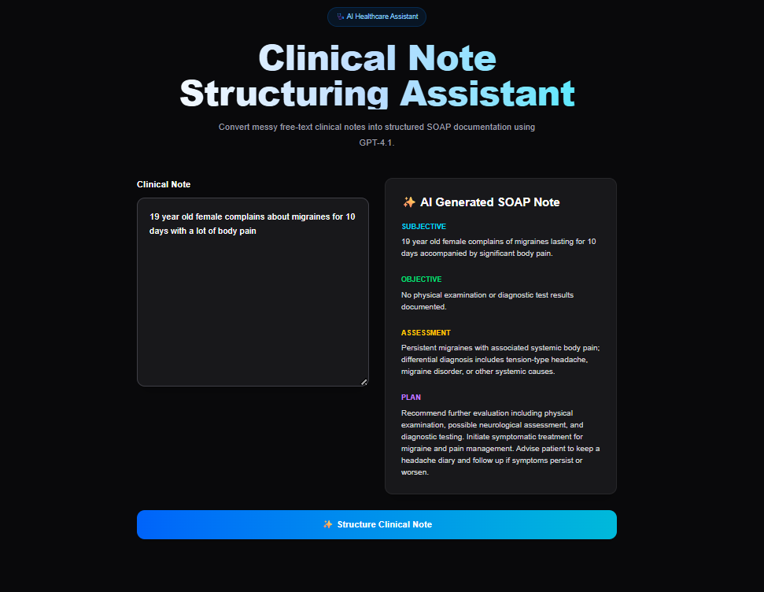

# 🩺 Day 001 — Clinical Note Structuring Assistant

> Transform unstructured clinical notes into organized SOAP notes using AI.


---

## 📌 Problem

Healthcare providers often capture information in free-text notes that can be difficult to read, inconsistent in format, and time-consuming to organize.

This project demonstrates how AI can help structure clinical documentation into the widely used **SOAP** format while keeping clinicians in control of medical decision-making.

---

## 💡 Solution

The Clinical Note Structuring Assistant accepts a free-text clinical note and uses an LLM to organize the information into a structured SOAP note.

**SOAP Format**

- **S** – Subjective
- **O** – Objective
- **A** – Assessment
- **P** – Plan

> **Note:** This application is intended for educational and demonstration purposes only. It does **not** provide medical advice or replace clinical judgment.

---

## ✨ Features

- Convert free-text notes into SOAP format
- Simple, clean web interface
- AI-powered note organization
- Copy structured output
- Responsive design
- Deployable to Vercel

---

## 🖥 Demo

**Live Demo**

(https://clinical-note-structuring.vercel.app/)

---

## 📸 Screenshots


---

## 🏗 Architecture

```text
User
   │
   ▼
Next.js Frontend
   │
   ▼
API Route
   │
   ▼
OpenAI API
   │
   ▼
Structured SOAP Note
```

---

## 🛠 Tech Stack

- Next.js 16
- TypeScript
- Tailwind CSS
- OpenAI API
- Vercel

---

## 🚀 Running Locally

```bash
npm install
npm run dev
```

Create a `.env.local` file:

```env
OPENAI_API_KEY=your_api_key_here
```

---

## 📂 Project Structure

```text
day-001-clinical-note-structuring/
│
├── app/
├── components/
├── lib/
├── types/
├── utils/
├── public/
└── README.md
```

---

## 🔮 Future Improvements

- Export as PDF
- Download as Markdown
- Prompt templates
- Structured JSON output
- FHIR compatibility
- Multi-language support
- Medical terminology highlighting

---

## 📚 Lessons Learned

_To be completed after finishing the project._

---

## ⚠ Disclaimer

This project is for educational purposes only.

It should **not** be used for clinical decision-making, diagnosis, treatment recommendations, or real patient care.

Always consult qualified healthcare professionals when making medical decisions.

---

## 🚀 100 Days • 100 AI Agents

This project is part of my **100 Days • 100 AI Agents** challenge.

Follow the journey:

- 🌐 Portfolio: **https://shreyachakrabarti.ai**
- 💻 Repository: **https://github.com/shreya19888/100-days-100-agents**

---

## 💭 Reflection

Building this project reinforced how important structured outputs are for AI applications. Instead of generating plain text, the model organizes information into a predictable format that is easier to validate and display. This foundation can later be extended to support healthcare interoperability standards such as FHIR and more advanced clinical documentation workflows.