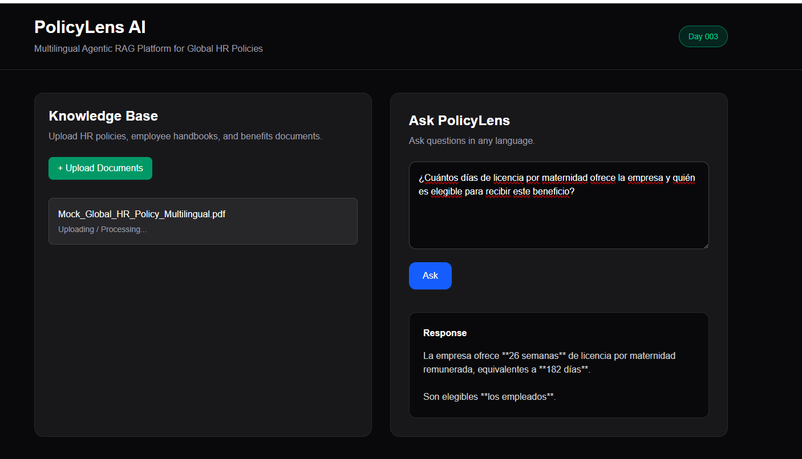
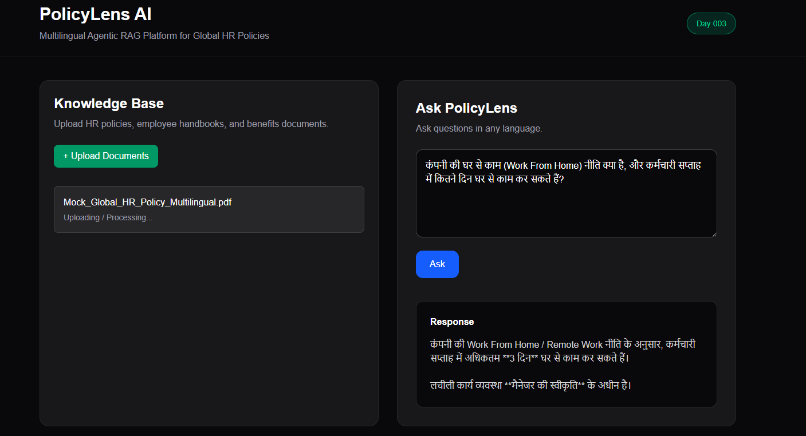

# 📄 PolicyLens AI

An AI-powered multilingual HR policy assistant built with **Next.js**, **OpenAI**, and **Chroma Cloud**.

Upload HR policy PDFs and ask questions in natural language—even in different languages. PolicyLens AI uses Retrieval-Augmented Generation (RAG) to retrieve the most relevant policy sections and generate accurate answers.

---

## 🚀 Features

- 📄 Upload HR policy PDFs
- 🔍 Automatic text extraction
- 🧩 Intelligent document chunking
- 🧠 OpenAI embeddings
- ☁️ Chroma Cloud vector database
- 💬 Multilingual policy Q&A
- 🌍 Ask questions in English, Spanish, Hindi, and more

---

## 🛠️ Tech Stack

- Next.js 16
- React 19
- TypeScript
- OpenAI API
- Chroma Cloud
- PDF Parser
- Tailwind CSS

---

## 📸 Demo

### Upload & Process Policy Documents



---

### Multilingual Policy Search



---

## Example Questions

### 🇺🇸 English

> What is the company's maternity leave policy?

### 🇪🇸 Spanish

> ¿Cuántos días de licencia por maternidad ofrece la empresa y quién es elegible para recibir este beneficio?

### 🇮🇳 Hindi

> कंपनी की घर से काम (Work From Home) नीति क्या है, और कर्मचारी सप्ताह में कितने दिन घर से काम कर सकते हैं?

---

## Project Structure

```text
app/
components/
lib/
 ├── embeddings/
 ├── parsers/
 ├── services/
 └── vectorstore/
types/
```

---

## Running Locally

```bash
npm install
npm run dev
```

Create a `.env.local` file:

```env
OPENAI_API_KEY=your_key

CHROMA_API_KEY=your_key
CHROMA_TENANT=your_tenant
CHROMA_DATABASE=policylensai
```

---

## Future Improvements

- Source citations
- Policy versioning
- Role-based document access
- Conversation history
- OCR support for scanned PDFs
- Support for DOCX and HTML documents

---

## Part of

# 🚀 100 Days • 100 AI Agents

Building and shipping 100 practical AI agents in 100 days.

Follow the journey:
**https://github.com/shreya19888/100-days-100-agents**