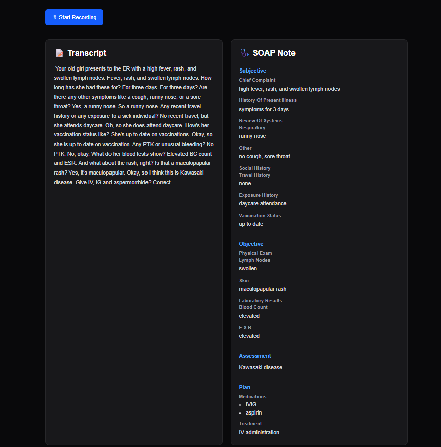
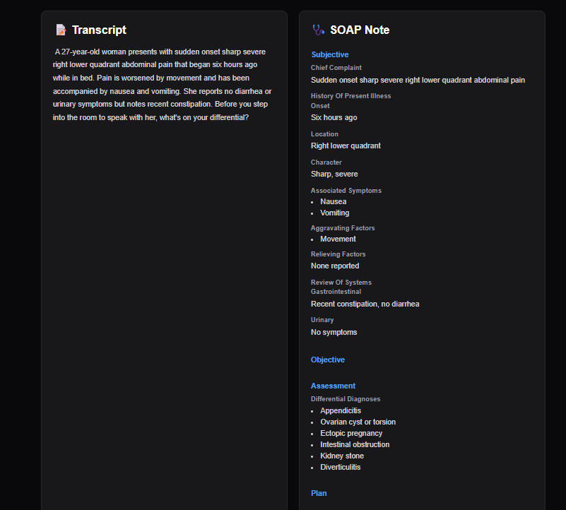

# 🎙 Clinical Voice Copilot

AI-powered clinical documentation assistant built with **Next.js**, **Groq Whisper**, and **Llama 3.3**.

Clinical Voice Copilot converts spoken patient encounters into structured SOAP notes using AI, helping clinicians spend less time documenting and more time with patients.

---

## 🚀 Features

- 🎙 Browser-based voice recording
- ⚡ Speech-to-text transcription using Groq Whisper
- 🩺 AI-generated SOAP notes
- 📋 Structured clinical documentation
- 📖 Dynamic rendering of nested clinical information
- 💻 Modern responsive Next.js UI

---

## 🖼 Demo

### Home Screen



---

### Generated Clinical Documentation



---

## 🏗 Architecture

```text
Voice Recording
        │
        ▼
Groq Whisper Transcription
        │
        ▼
Clinical Transcript
        │
        ▼
SOAP Generation (Llama 3.3)
        │
        ▼
Structured Clinical Documentation
```

---

## 🛠 Tech Stack

### Frontend

- Next.js 16
- React
- TypeScript
- Tailwind CSS

### AI

- Groq API
- Whisper Large V3 Turbo
- Llama 3.3 70B Versatile

---

## 📂 Project Structure

```text
app/
├── api/
│   ├── voice/
│   │   └── transcribe/
│   └── clinical/
│       └── process/
│
components/
├── AudioRecorder.tsx
└── SoapViewer.tsx
│
lib/
├── groq.ts
└── clinical/
    └── soap.ts
```

---

## ⚙️ Installation

Clone the repository.

```bash
git clone https://github.com/shreya19888/100-days-100-agents.git
```

Navigate to the project.

```bash
cd day-004-clinical-voice-copilot
```

Install dependencies.

```bash
npm install
```

Create a `.env.local` file.

```env
GROQ_API_KEY=your_groq_api_key
```

Start the development server.

```bash
npm run dev
```

Open:

```
http://localhost:3000
```

---

## 🧠 How It Works

1. Record a patient encounter.
2. Audio is sent to Groq Whisper for transcription.
3. The transcript is analyzed by Llama 3.3.
4. A structured SOAP note is generated.
5. The UI dynamically renders the clinical documentation.


## 👩‍💻 Author

**Shreya Chakrabarti**


GitHub: https://github.com/shreya19888

Portfolio: https://www.shreyachakrabarti.ai

