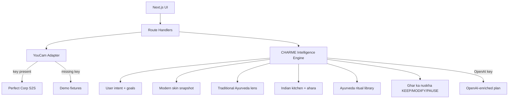

# CHARME

**Ancient wisdom. Modern skin intelligence.**

CHARME is a modern skin wellness companion inspired by Ayurveda, Indian food wisdom, and generations of everyday beauty rituals — personalized using AI skin analysis.

> What your grandmother knew. What your skin tells us today. What you can do next.

Core principle: **CHARME doesn’t judge your skin.** Understanding what a selfie shows is separate from deciding what — if anything — you want to change.

## Problem

Most skin apps either dump raw scores or push product catalogs. Family wisdom gets ignored — or blindly endorsed. People need a bridge between what a selfie shows and what they can actually do with the foods and rituals they already know — without being told their skin is a problem.

## Solution

CHARME follows:

**LOOK → INTENT → UNDERSTAND → NOURISH → RITUAL → RECHECK**

It holds two lenses side by side:

- **Modern Lens** — YouCam visual skin snapshot
- **Traditional Lens** — optional Ayurveda-inspired lifestyle questions (framework, not diagnosis)

Plus:

- **Your intent** — just learn, understand, habits, rituals, or explore change (multi-select + personal goals)
- Indian kitchen guidance (ahara)
- Ghar ka nuskha evaluation (**KEEP / MODIFY / PAUSE**)
- Dinacharya-inspired daily rhythm
- A **varied 7-day Ayurveda-inspired ritual journey** (ubtan, soft masks, mists, light abhyanga, comfort practices) using kitchen staples — not one repeated treatment

This is **not** a medical diagnostic product.

## Local development

```bash
npm install
cp .env.example .env.local
npm run dev
```

Open [http://localhost:3000](http://localhost:3000). Use **Load Demo** for the full Indian persona flow without API keys.

Dev uses `node --use-system-ca` so YouCam / OpenAI TLS works reliably on Windows.

## Environment

```bash
YOUCAM_API_KEY=
YOUCAM_SECRET_KEY=
OPENAI_API_KEY=
AI_MODEL=gpt-4o-mini
```

Keys stay server-side. Without YouCam keys, analysis falls back to demo fixtures. Without OpenAI, the rule-based CHARME engine still builds a plan.

## Architecture



YouCam and OpenAI calls remain server-side. Demo mode works without credentials.

## Rituals

When you choose rituals (or traditional wellness), the week rotates concrete kitchen practices such as:

- Gentle besan–dahi ubtan
- Thin honey or soft haldi–dahi masks
- Rose-water mist, aloe seal, cucumber comfort
- Light abhyanga / limb oiling
- Rice-water rinse, milk cleanse, seasonal multani mitti (when appropriate)

Suggestions prefer ingredients you already selected, soften or skip stronger pastes when redness looks elevated, and always include patch-test / optional / not-medical-treatment language. Indian terms (besan, ubtan, abhyanga, dahi, etc.) are glossed in plain English in the ritual UI.

## Safety & dignity

- Cosmetic / self-care language only — never medical diagnosis from a photo
- Ayurveda as traditional framework, never “you have Pitta skin”
- No cure / detox / fairness / lightening claims
- KEEP / MODIFY / PAUSE for home wisdom — not blind endorsement of DIY topicals
- Pigment / named-condition framing only when the user shares that context in notes
- Visible safety footer throughout the flow
